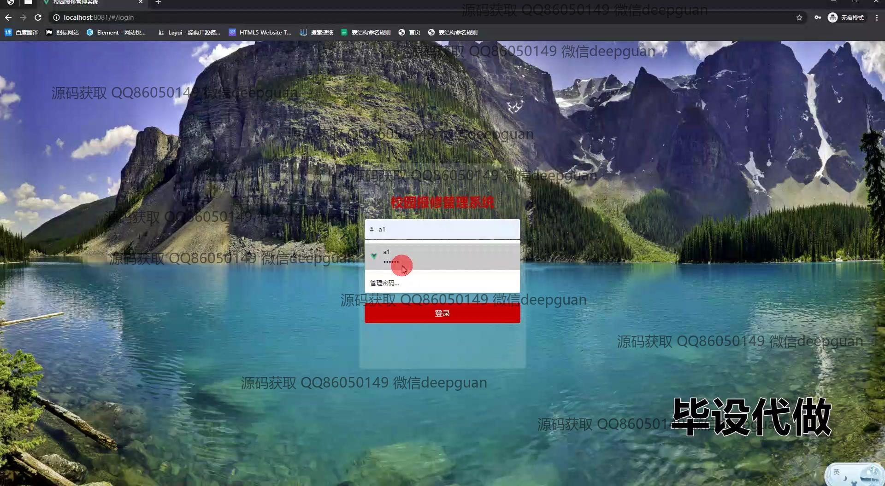
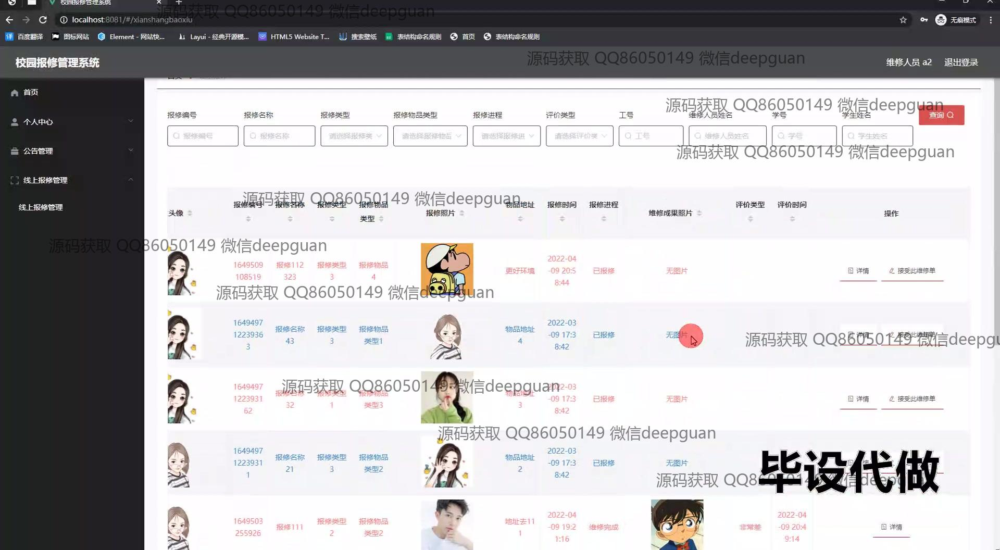
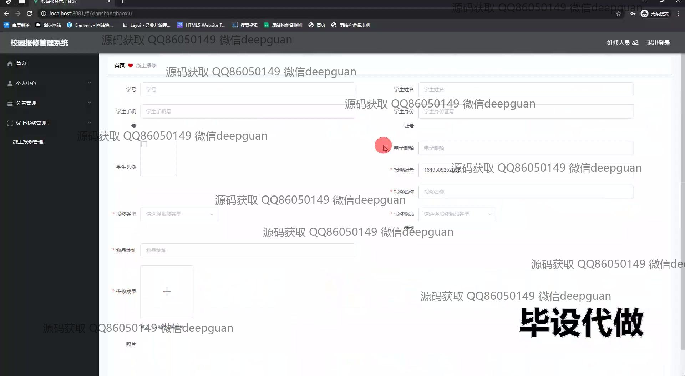

<h1 align="center">基于Web的校园报修管理系统+vue</h1>

## 简介
校园报修管理系统：角色分为管理员、维修人员、学生；公告管理、报修记录管理、维修状态管理、用户信息维护    --计算机毕业设计源码；毕设源码；java毕业设计源码

## 联系方式

<h3 align="center">获取完整代码与数据库文件 + 微信：deepguan QQ: 86050149 QQ群: 783742310</h3>

<h3 align="center">可帮忙远程部署 包运行成功！提供远程部署、修改代码、设计文档指导、代码讲解等服务！</h3>

## 功能介绍（完整见运行截图）
管理员：登录、注册、退出功能；主页导航和用户管理；管理报修物品类型、公告、维修人员和学生信息；查看和管理报修记录，包括新增、删除和修改公告；支持通过报修编号、名称、类型等进行搜索和筛选；生成报修统计报表，辅助资源优化和决策。  
维修人员：查看、接受和管理报修信息；详情查看和维修单处理；通过导航栏查看和管理个人信息、公告；上传维修结果并评价；查看报修类别和数量统计，以便合理分配工作。  
学生：在线提交报修请求；查看和管理个人提交的报修信息；支持通过条件筛选和查询特定报修单；查看公告和维修进度，进行报修评价。  
访客用户：访问主页，查看公告信息和简要的系统介绍；通过登录界面选择角色身份进行身份验证，进入系统相应功能模块。

## 运行截图

本代码来源于网络,仅供学习参考使用!

